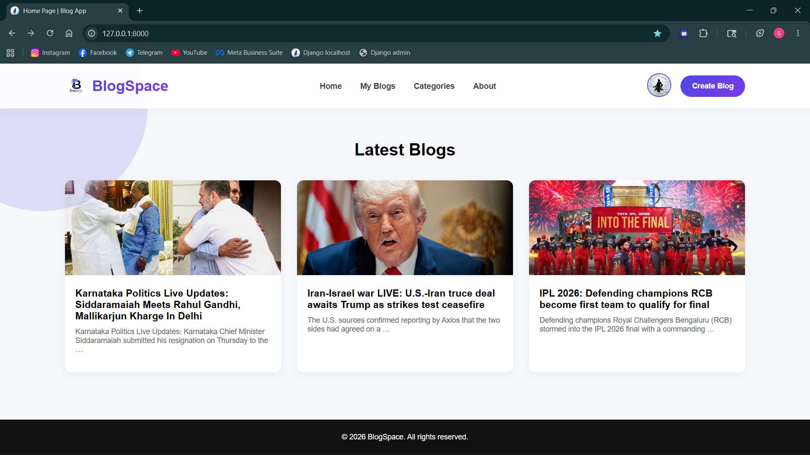
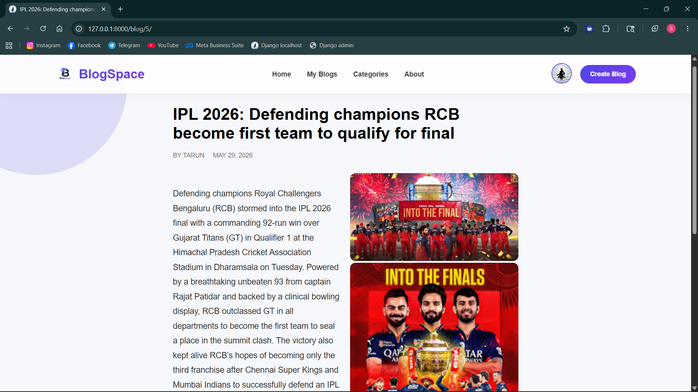
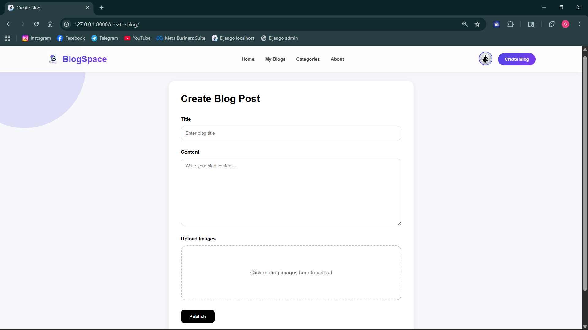
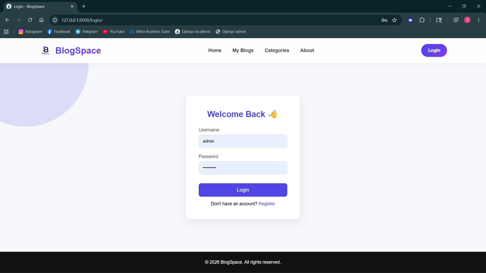
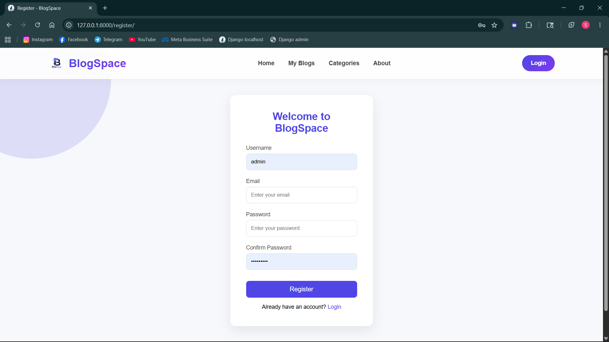

# 🚀 BlogSpace

A modern blogging platform built with Django that allows users to create, publish, and manage blog posts with image uploads, user authentication, profile management, and creator verification.

## ✨ Features

* 🔐 User Authentication (Register, Login, Logout)
* 📧 Email OTP Verification
* 👤 User Profiles
* 📝 Create and Publish Blog Posts
* 📸 Multiple Image Uploads per Blog
* 📰 Blog Listing Page
* 📖 Blog Detail View
* 🎨 Modern Responsive UI
* 🔒 Secure Environment Variables using `.env`
* 🖼 Custom Favicon and Branding

---

## 🛠 Tech Stack

### Backend

* Python
* Django

### Frontend

* HTML
* CSS
* JavaScript

### Database

* SQLite (Development)

### Email Service

* Gmail SMTP

---

## 📂 Project Structure

```text
blog_project_new/
│
├── blog_app_new/
├── blog_project_new/
├── static/
│   ├── css/
│   ├── js/
│   └── images/
│
├── media/
├── templates/
├── manage.py
├── requirements.txt
└── .env
```

---

## ⚙️ Installation

### Clone Repository

```bash
git clone https://github.com/tarun-tejeswar/django-blog-app.git
cd django-blog-app
```

### Create Virtual Environment

```bash
python -m venv env
```

### Activate Virtual Environment

Windows:

```bash
env\Scripts\activate
```

Linux/Mac:

```bash
source env/bin/activate
```

### Install Dependencies

```bash
pip install -r requirements.txt
```

---

## 🔑 Environment Variables

Create a `.env` file in the project root.

```env
SECRET_KEY=your_secret_key

EMAIL_HOST_USER=your_email@gmail.com
EMAIL_HOST_PASSWORD=your_app_password
```

---

## 🗄 Database Setup

```bash
python manage.py makemigrations
python manage.py migrate
```

---

## ▶ Run Development Server

```bash
python manage.py runserver
```

Open:

```text
http://127.0.0.1:8000/
```

---

## 📸 Screenshots

Add screenshots of:

* Home Page



* Blog Detail Page



* Create Blog Page



* Login/Register Page






---

## 🚧 Future Improvements

* Blog Categories
* Comments System
* Likes & Reactions
* Search & Filtering
* Rich Text Editor
* Bookmark Feature
* User Following System
* REST API
* Dark Mode

---

## 🤝 Contributing

Contributions are welcome. Feel free to fork the repository and submit a pull request.

---

## 👨‍💻 Author

**Tarun Tejeswar**

GitHub: https://github.com/tarun-tejeswar